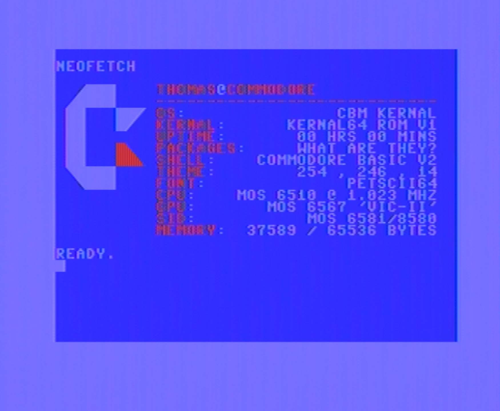

# Neofetch BASIC "port" for the Commodore 64

There are two versions:

Normal:

Right-Align:

PRG files are executable on C64. TXT files are plaintext for your viewing outside of a Commodore BASIC environment.

This has been written on a real Commodore 64 breadbin - no IDEs here, we die like men.

The program takes a username input before printing - this is used to fill the "user@commodore" line.
System memory and uptime are real info - uptime uses $TI and memory uses FRE().
The rest of the information is static (so feel free to change to suit your machine if you wish).

Heavily based on [Oshaboy's version](https://github.com/oshaboy/neofetch.d64).

I re-wrote this solely to get some real information being printed, and because I wanted a purely BASIC version for the fun of it.
It's also the very first "proper" BASIC program I've written, so it was a fun little challenge.
